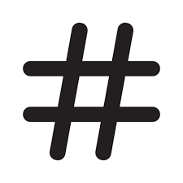
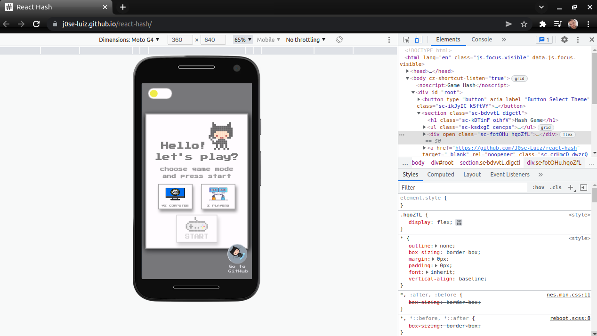
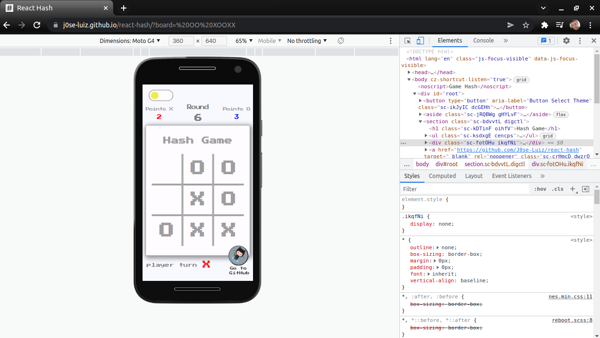
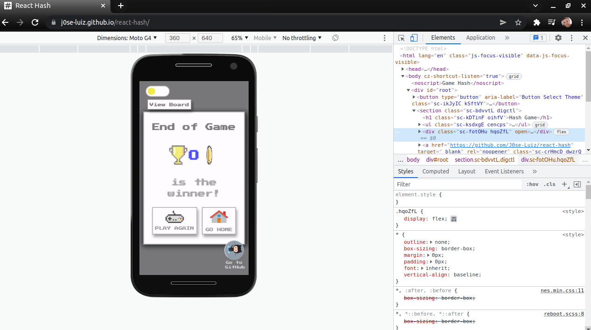
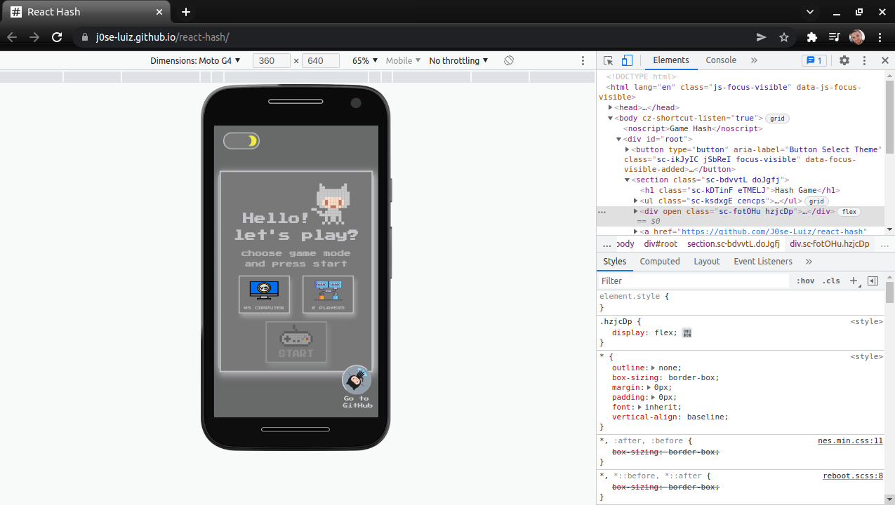
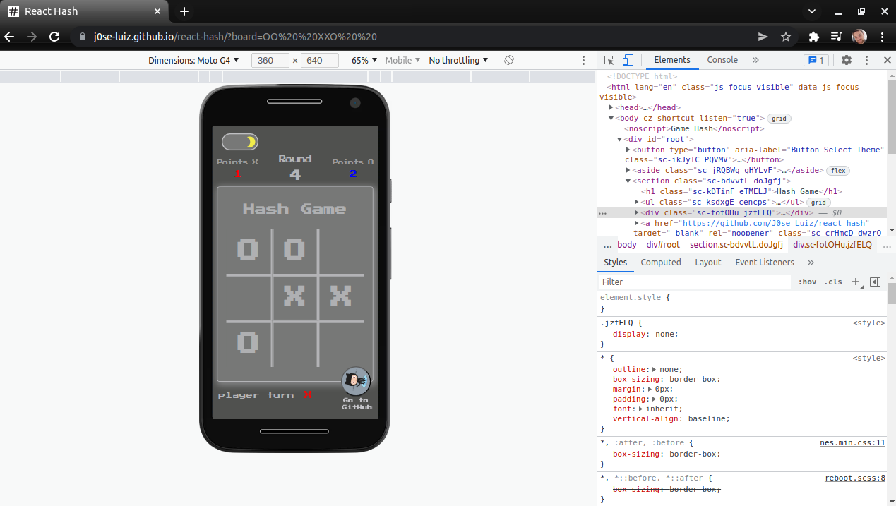
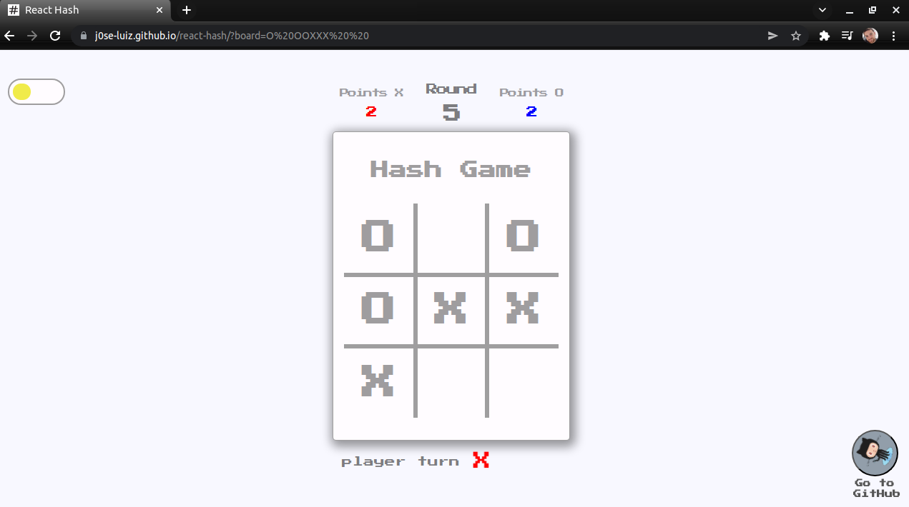
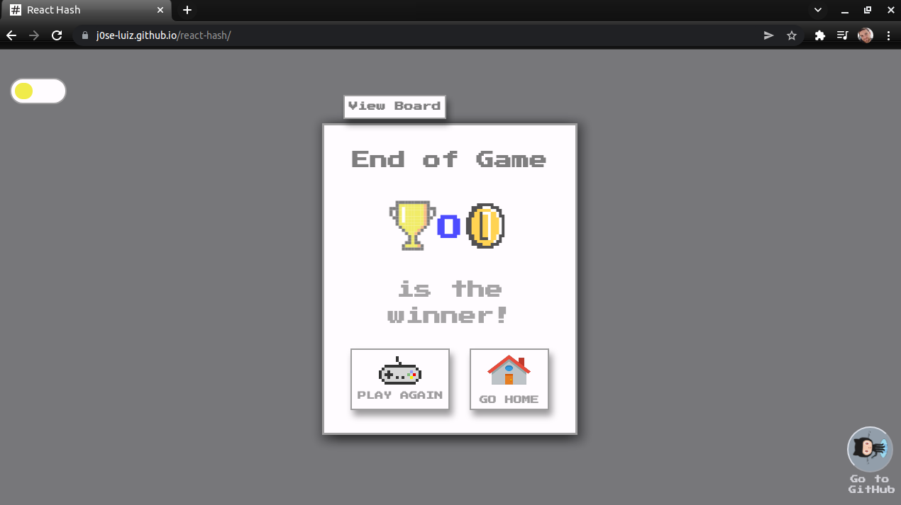
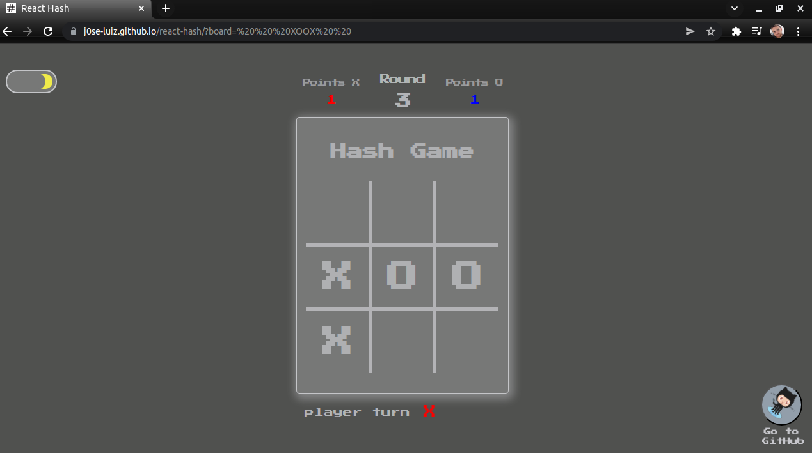

<h1 align="center"> React Hash :video_game: :hash:</h1><br/>


<a align="center" href="j0se-luiz.github.io/react-hash/" target="_blank"> :video_game:   :video_game: :video_game: Hash Game, or Tic Tac Toe, this game click here see instructions below or continue to download the game
</a>

<br/>

## **Tic-tac-toe** or **HASH** zeros Xs and Os is a paper-and-pencil game for two players who take turns marking spaces in a three-by-three grid with an X or a . The player who manages to place three of his marks in a horizontal, vertical or diagonal line is the winner. It is a resolved game, with a forced draw assuming the best play of both players. [see more about the subject](https://en.wikipedia.org/wiki/Tic-tac-toe#Strategy)

<br>


<p align="center">Lets go to what matters ...</p>
<br/>

<h2 align="center"><strong> Instructions and controls</strong></h2>

<br/>

<P align="center"><strong> MOBILE </strong></P>

<p align="center">select the game mode, if it is against another player or against the computer and <strong> click on start, click on where the move will be. </strong></p><br/>

<p align="center">Theme <strong>Light</strong></p>

<section align="center">





<p align="center">Theme <strong>Dark</strong></p>





<p align="center"><strong>Demonstration Game Mobile</strong></p>


</section><br/>

<P align="center"><strong> DESKTOP </strong></P>

<p align="center">select the game mode, if it is against another player or against the computer and click on start, <strong> use the mouse to choose where the move will be. </strong></p><br/>

<p align="center">Theme <strong>Light</strong></p>

<section align="center">





<p align="center">Theme <strong>Dark</strong></p>





<p align="center"><strong>Demonstration Game Desktop</strong></p>


</section> 

<br/>

## these were the technologies/methodology/framework used to build this tic-tac-toe/hash.
<br/>
<a href="https://atomicdesign.bradfrost.com/chapter-2/"> 
</a>
<br/>

 used **Atomic Design Methodology** to organize the components 
 <br/>
 <br/>

 [](https://pt-br.reactjs.org/docs/getting-started.html)
<br/>
I used **React**
<br/>
<br/>

[](https://docs.npmjs.com/cli/v7/commands/npm-install)
<br/>
made with **NPM**
<br/>
<br/>


[](https://www.typescriptlang.org/docs/)
<br/>
the project was all typed with **Icript**
<br/>
<br/>

[](https://styled-components.com/)
<br/>
for the styling of the components and the page I used **Styled Components**
<br/>
<br/>

[](https://reactrouter.com/docs/en/v6/getting-started/installation)
<br/>
I used **React Router** for the routes
<br/>
<br/>


<a href="https://nostalgic-css.github.io/NES.css/"> 
</a>
<br/>
I used the **NES.css** framework for some styles and some animations
 <br/>
 <br/>

## **Installation**

Look for the folder where you want to place the game, open a terminal tab and type this command below to clone the project, follow the rest of the guidelines to play on your computer

```bash
git clone https://github.com/J0se-Luiz/react-hash.git
```

After the game `react-hash` has been downloaded enter the following commands

```bash
 cd react-hash
 npm install
```

All set, now to play just type the following command

```bash
npm start
```
<br/>

---
<br/>
<br/>
<br/>


## have fun i hope you like it! = )